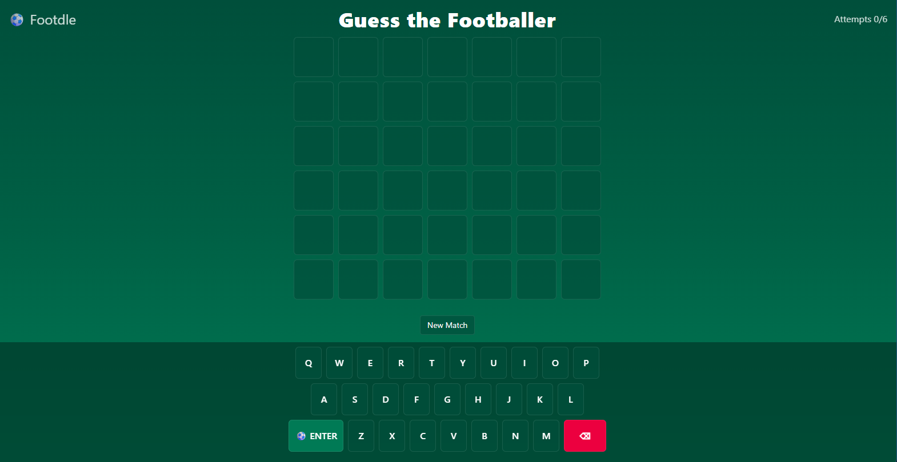
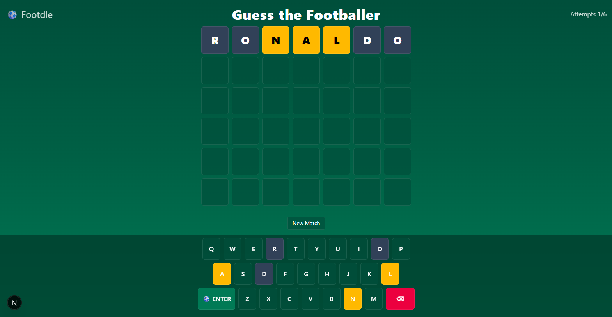

# ⚽ Footdle — Wordle for Football Fans

 <!-- Replace with your image path -->
<!-- Optional badges -->
   

---

## 🧩 What is Footdle?

**Footdle** is a Wordle-style guessing game for football players' names.  
Each day, a new mystery player is chosen — your job is to guess who it is!

You have **6 attempts** to find the correct player.  
After each guess, the tiles change color to show how close you are:

- 🟩 **Green** – Correct letter in the correct position  
- 🟨 **Yellow** – Letter exists in the name, but in a different spot  
- ⬛ **Gray** – Letter not in the player’s name  

Think you know your footballers? Give it a shot!

---

## 🎮 Gameplay

1. Type a **football player’s name** and press **Enter**.  
2. The grid updates with colored hints (like Wordle).  
3. Use logic and your football knowledge to refine your guesses.  
4. Guess correctly within 6 tries to win the day’s Footdle!  
5. Share your results with friends using the copyable emoji grid.

 <!-- optional second screenshot -->

---

## 🧠 Features

- ⚽ Daily player rotation (everyone gets the same player each day)  
- 🟨 Smart letter feedback (handles duplicate letters correctly)  
- 🔤 Supports names with accents & multiple words  
- 🕹️ Smooth animations and responsive design  
- 💾 Progress saved locally (no account needed)  
- 🧭 Built with **Next.js + TypeScript + Tailwind CSS**  

---

## 🚀 Run Locally

Clone the repository and start the dev server:

```bash
git clone https://github.com/yassersan/footdle.git
cd footdle
npm install
npm run dev
